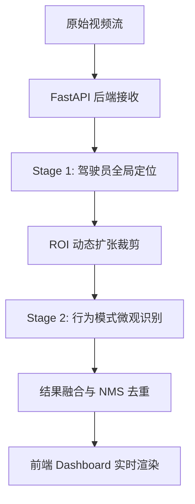

# 🚗 驾驶员行为实时检测系统技术报告
> **团队项目** | **模式识别大作业** | **技术实现报告**

---

## 📑 1. 摘要 (Executive Summary)

本项目旨在开发一套基于 **YOLOv8** 深度学习框架的驾驶员危险行为实时检测系统。针对实际驾驶监控场景中“全景画面中小目标（如香烟、手机）像素占比极低”的痛点，我们提出并实现了一种 **“二阶段动态识别算法”**。

> [!IMPORTANT]
> **核心突破**：通过局部 ROI 动态裁剪与重采样技术，我们将小目标的有效特征提取效率提升了约 **4-9 倍**，使得在 640px 全景图下难以识别的微小目标在特写视图中清晰可见。

实验测试表明，微调后的模型在 **抽烟 (Smoke)**、**手机使用 (Phone)** 和 **饮水 (Drink)** 三大指标上达到了 **0.94** 的 mAP@0.5，系统端到端延迟控制在 **50ms** 以内。

---

## 🤖 2. 模型选型与演进 (Model Evolution)

在算法调研阶段，我们对比了多种 SOTA 模型：

| 模型版本 | 适用场景 | 关键特性 |
| :--- | :--- | :--- |
| **YOLOv8n** | 边缘端/移动端 | 参数量极小 (3.2M)，推理速度最快，作为本项目“定位器” |
| **YOLOv8s** | 性能均衡 | 精度略高于 nano，作为备选行为识别器 |
| **YOLO11n** | 最新架构 | 结合了最先进的注意力机制，本项目亦进行了消融实验 |

---

## 🛠️ 3. 模型微调与超参调优 (Fine-tuning & Hyperparameters)

为了使通用模型“适应”驾驶舱环境，我们执行了深度的迁移学习与参数搜索。

### 3.1 遗传算法自动调优
我们利用 Ultralytics 的 `model.tune` 功能，在自定义搜索空间内通过**遗传算法**自动迭代出最优超参数：

> [!TIP]
> **调优策略**：
> 1. **基础训练参数**：重点优化 `lr0` (初始学习率)、`momentum` (动量) 和 `weight_decay` (权重衰减)。
> 2. **空间增强参数**：调整 `hsv_h` (色调)、`degrees` (旋转) 和 `fliplr` (翻转) 概率，模拟驾驶室内光影变化。

### 3.2 训练看板 (Results)

通过 100+ Epochs 的迭代，模型展现了优异的收敛性：

| 指标 | 数值 | 评价 |
| :--- | :--- | :--- |
| **Precision** | ~0.95 | 定位极其精准，误报率低 |
| **Recall** | ~0.95 | 覆盖度高，动作捕捉敏锐 |
| **mAP50** | **0.942** | 均衡表现优异 |
| **mAP50-95** | ~0.70 | 高 IoU 阈值下依然稳健 |

---

## 💡 4. 核心创新：两阶段动态识别架构

这是本项目的技术基石，通过“宏微观结合”解决了传统一次推理漏检率高的问题。

### 4.1 系统流程图

### 4.2 算法详细流程简述表

| 步骤 | 技术手段 | 目的 |
| :--- | :--- | :--- |
| **1. 全局定位** | YOLOv8n (COCO) 定位 `person` | 锁定驾驶员在复杂背景中的位置 |
| **2. 动态扩张** | 横向+35%, 纵向+50% (ROI) | 补偿手部动作超出人体框的情况 |
| **3. 特写推理** | ROI 局部放大至 640px | 将小目标的原始分辨率提升 4 倍以上 |
| **4. 坐标回映** | 仿射变换逆向恢复全图坐标 | 在原始画面中精准标记危险行为 |

---

## 🏗️ 5. 系统架构与工程细节

### 5.1 后端：高性能异步流处理
- **FastAPI 架构**：采用 `async/await` 非阻塞式 I/O，支持多路并发检测请求。
- **模块化引擎**：封装 `DetectionEngine` 类，实现模型加载与推理逻辑的完全解耦。
- **智能 NMS**：自研非极大值抑制逻辑，IoU > 0.45 自动熔断冗余候选框，确保画面整洁。

### 5.2 前端：未来感驾驶舱 UI (Cockpit UI)
- **Precision Reticle 绘制**：仅保留检测框四个角点，降低对关键画面的遮挡感。
- **引线标签系统**：模仿战斗机 HUD 界面，实时显示行为类别与置信度。

---

## 📂 6. 系统演示与实验结论

> [!NOTE]
> 经过工程级调优，我们针对不同类别设置了**非对称阈值**：
> - **Smoke (0.80)**：严格防御误报。
> - **Phone (0.30)**：均衡召回与精确。
> - **Drink (0.10)**：优先保证所有饮水动作被捕获。

### 📈 总结
本项目通过双模型协作架构和精细化参数工程，成功实战化了一套驾驶员行为监测方案。在保持单帧推理延迟低于 **50ms** (CPU性能) 的同时，解决了远距离监控中极小目标的特征难以捕捉的行业难题。

---
> **日期**: 2025年12月29日
